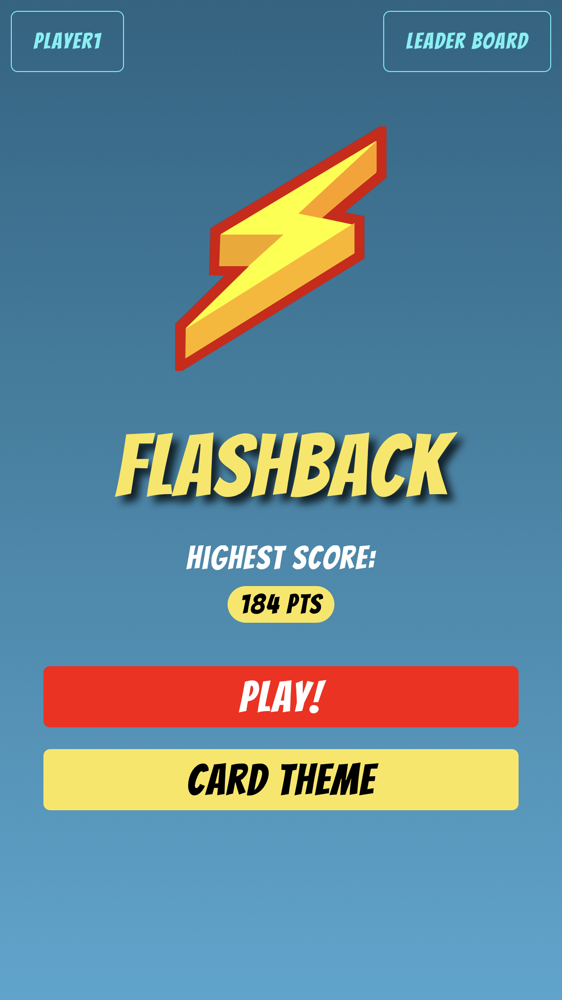

# Flashback

A fun little project to learn React Native. Flashback is a simple mobile app game that allows user to play a memory game which calculates your score based on
 accuracy and speed.

## Screenshots

Intro Screen:

## Built With

* HTML
* CSS
* JavaScript
* React Native
* Node.js
* Expo

## Features

* Calculates score based on accuracy and speed
* Track high score
* Themes feature for different card images

## Future implementations

* Different difficulty settings
* Different modes
* Upload custom images as theme

## Author

* **Anawin Vanichyanukroh** - ** - Front-End Development, Back-End Development, Testing, Styling
